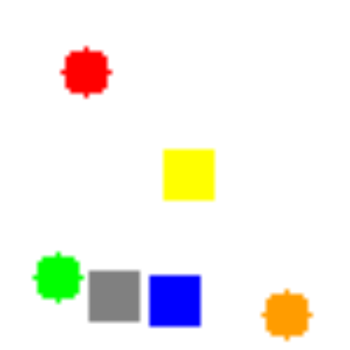

Pytorch implementation of Relational Networks - [A simple neural network module for relational reasoning](https://arxiv.org/pdf/1706.01427.pdf)

Implemented & tested on Sort-of-CLEVR task.

## Sort-of-CLEVR

Sort-of-CLEVR is simplified version of [CLEVR](http://cs.stanford.edu/people/jcjohns/clevr/).This is composed of 10000 images and 20 questions (10 relational questions and 10 non-relational questions) per each image. 6 colors (red, green, blue, orange, gray, yellow) are assigned to randomly chosen shape (square or circle), and placed in a image.

Non-relational questions are composed of 3 subtypes:

1) Shape of certain colored object
2) Horizontal location of certain colored object : whether it is on the left side of the image or right side of the image
3) Vertical location of certain colored object : whether it is on the upside of the image or downside of the image

Theses questions are "non-relational" because the agent only need to focus on certain object.

Relational questions are composed of 3 subtypes:

1) Shape of the object which is closest to the certain colored object
1) Shape of the object which is furthest to the certain colored object
3) Number of objects which have the same shape with the certain colored object

These questions are "relational" because the agent has to consider the relations between objects.

Questions are encoded into a vector of size of 11 : 6 for one-hot vector for certain color among 6 colors, 2 for one-hot vector of relational/non-relational questions. 3 for one-hot vector of 3 subtypes.



I.e., with the sample image shown, we can generate non-relational questions like:

1) What is the shape of the red object? => Circle (even though it does not really look like "circle"...)
2) Is green object placed on the left side of the image? => yes
3) Is orange object placed on the upside of the image? => no

And relational questions:

1) What is the shape of the object closest to the red object? => square
2) What is the shape of the object furthest to the orange object? => circle
3) How many objects have same shape with the blue object? => 3

## Setup

Create conda environment from `environment.yml` file
```
$ conda env create -f environment.yml
```
Activate environment
```
$ conda activate RN3
```
If you don't use conda install python 3 normally and use `pip install` to install remaining dependencies. The list of dependencies can be found in the `environment.yml` file.

## Usage

	$ ./run.sh

or

  	$ python sort_of_clevr_generator.py

to generate sort-of-clevr dataset
and

 	 $ python main.py 

to train the binary RN model. 
Alternatively, use 

 	 $ python main.py --relation-type=ternary

to train the ternary RN model.

## Modifications
In the original paper, Sort-of-CLEVR task used different model from CLEVR task. However, because model used CLEVR requires much less time to compute (network is much smaller), this model is used for Sort-of-CLEVR task.

## Result

| | Relational Networks (20th epoch) | CNN + MLP (without RN, 100th epoch) |
| --- | --- | --- |
| Non-relational question | 99% | 66% |
| Relational question | 89% | 66% |

CNN + MLP occured overfitting to the training data.

Relational networks shows far better results in relational questions and non-relation questions. 

## Application Demo
You can randomly generate and move 2D shaped objects and edit text to ask questions.

## Usage

  	$ python application.py


## Contributions

[@gngdb](https://github.com/gngdb) speeds up the model by 10 times.

[@neural022](https://github.com/neural022) and [hhhlll21qq](https://github.com/hhhlll21qq) Application build
